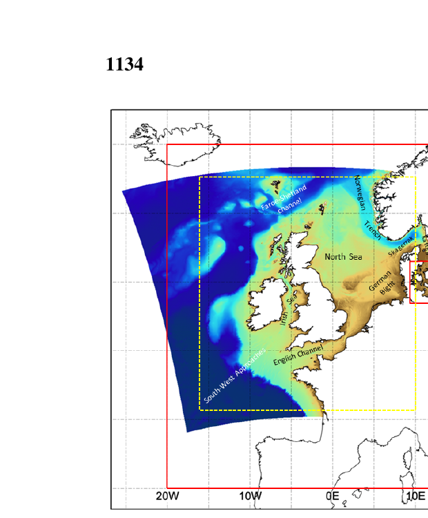
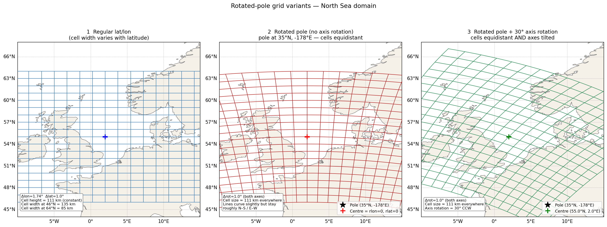

# AMM7 and AMM15 grid types

Notes on the Met Office North-West European Shelf (NWS) model configurations,
relevant for understanding rotated-pole grids in this region.

Source: Tonani et al. (2019), *Ocean Science* 15, 1133–1158.
<https://doi.org/10.5194/os-15-1133-2019>

---

## Summary

| | AMM7 | AMM15 |
|--|------|-------|
| Grid type | **Regular lat/lon** | **Rotated pole** |
| Resolution | 7 km | 1.5 km |
| Domain | 40–65 °N, 20 °W–13 °E | ~45–63 °N, ~20 °W–13 °E |
| Grid points | 297 × 375 | ~1000 × ~1200 (est.) |
| Vertical levels | 51 | 51 |
| CMEMS product | NWSHELF_MULTIYEAR_PHY_004_009 | NWSHELF_ANALYSIS_FORECAST_PHY_004_013 |
| Bathymetry | GEBCO (NOOS-corrected) | EMODnet 2015 |

---

## Key findings

**AMM7 uses a regular lat/lon grid.**  Cells are aligned with geographic
North/South/East/West and become progressively wider towards the equator
(cos(lat) distortion).  At 7 km resolution this distortion is acceptable.

**AMM15 uses a rotated pole**, chosen so that the grid equator runs through
the domain.  Quoting Table 1 of Tonani et al. (2019):

> *"The grid has a rotated pole, chosen so that the grid Equator runs through
> the domain to reduce the distortion of cells with increasing latitude.
> While the rotated latitude is constant, the longitudinal grid steps range
> from ~1.47 to 1.5 km."*

The small residual variation (1.47–1.50 km, ~2%) arises because the domain
spans several degrees of rotated latitude, so cells slightly off the rotated
equator are not perfectly square.  This is negligible at 1.5 km resolution.

---

## Domain figure

Figure 1 from Tonani et al. (2019).  The **red rectangle** is the AMM7 regular
lat/lon domain; the **tilted blue/yellow area** is the AMM15 rotated-pole domain.
The tilt relative to the geographic grid lines is clearly visible.

*EMODnet bathymetry (logarithmic scale, metres).  Red line = AMM7 domain
(regular grid).  Yellow dashed box = AMM15 Copernicus product area.
Figure modified from Graham et al. (2018b).*

---

## Rotated-pole grid visualisation

The file `rotated_pole_demo.png` (generated by `demo_rotated_pole.py`) shows
three panels for a North Sea domain:

1. **Regular lat/lon** — straight grid lines; cell width narrows towards the
   poles.
2. **Rotated pole, no axis rotation** — lines are slightly curved but still
   run roughly N–S / E–W; cells are equidistant.  This is what AMM15 looks
   like.
3. **Rotated pole + 30° axis rotation** — grid axes are visibly tilted relative
   to geographic N–S / E–W.  This combines pole placement with an explicit
   axis rotation.

---

## Implications for bathymetry regridding

- **AMM7**: use `grid.type: spherical` with `equidistant: true` and `dlat`
  set to the target resolution.  `dlon` is computed automatically from
  `dlat / cos(lat_centre)`.

- **AMM15-style**: use `grid.type: rotated_pole` (planned — see
  implementation plan) with `pole_lat` / `pole_lon` placed so the domain
  centre sits on the rotated equator.  Specify a single `drot` in rotated
  degrees; cells are equidistant everywhere by construction.

For matching an existing AMM15 grid from CMEMS exactly, read the
`domain_cfg.nc` file to obtain `grid_north_pole_latitude` and
`grid_north_pole_longitude`, then pass those directly as `pole_lat` / `pole_lon`.

---

## Reference

Tonani, M., Sykes, P., King, R. R., McConnell, N., Péquignet, A.-C., O'Dea,
E., Graham, J. A., Polton, J., and Siddorn, J. (2019).  The impact of a new
high-resolution ocean model on the Met Office North-West European Shelf
forecasting system.  *Ocean Sci.*, 15, 1133–1158.
<https://doi.org/10.5194/os-15-1133-2019>
